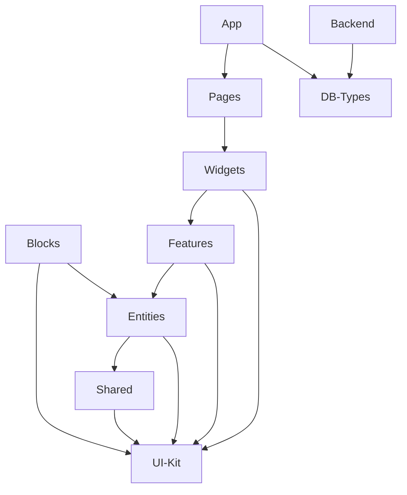

# 🏗️ Архитектурный аудит CMS-редактора

## 📋 Краткое резюме

**Статус:** ✅ Архитектура соответствует современным стандартам с незначительными улучшениями  
**Оценка:** 8.5/10  
**Критические проблемы:** Отсутствуют  
**Рекомендации:** Средний приоритет - улучшение модульности и документации

---

## 🎯 Текущая архитектура

### Общая структура проекта

Проект использует **монорепозиторий** с правильным разделением ответственности:

```
my-forum/
├── frontend/          # React + Vite + TypeScript
├── backend/           # Express + TypeScript + Supabase
├── packages/
│   ├── ui/           # Единый UI-Kit (Atomic Design)
│   └── db-types/     # Общие типы БД
└── supabase/         # Схемы и миграции БД
```

**✅ Сильные стороны:**
- Чёткое разделение фронтенда и бэкенда
- Выделенный UI-Kit в отдельный пакет
- Общие типы БД для type-safety
- Использование pnpm workspace для управления зависимостями

### Frontend архитектура (Feature-Sliced Design)

**Файл:** `frontend/src/`

```typescript
// frontend/vite.config.ts - Алиасы подтверждают FSD структуру
resolve: {
  alias: {
    app: path.resolve(rootDir, 'src/app'),
    pages: path.resolve(rootDir, 'src/pages'),
    widgets: path.resolve(rootDir, 'src/widgets'),
    features: path.resolve(rootDir, 'src/features'),
    entities: path.resolve(rootDir, 'src/entities'),
    shared: path.resolve(rootDir, 'src/shared'),
    store: path.resolve(rootDir, 'src/store'),
    blocks: path.resolve(rootDir, 'src/blocks'),
    ui: path.resolve(rootDir, '../../packages/ui/src'),
  },
}
```

**✅ Соответствие Feature-Sliced Design:**
- **App** - точка входа и провайдеры
- **Pages** - роутинг и страницы
- **Widgets** - сложные UI-блоки (LayoutManager, редакторы)
- **Features** - бизнес-функции (CreatePageModal, EditCategoryModal)
- **Entities** - доменные сущности (category, property, server)
- **Shared** - переиспользуемые компоненты и утилиты
- **Blocks** - система блоков редактора (atomic/layout)

### Backend архитектура

**Файл:** `backend/src/index.ts`

```typescript
// Чёткая слоистая архитектура
import layoutRouter from './routes/layoutRoutes'
import categoryRouter from './routes/categoryRoutes'
// ... другие роуты

// Middleware в правильном порядке
app.use(performanceMiddleware())
app.use(securityLoggingMiddleware())
app.use('/api', rateLimiters.general)
app.use('/api', loggingMiddleware())
```

**✅ Правильная структура:**
- **Routes** - маршруты API
- **Middleware** - промежуточные обработчики
- **Services** - бизнес-логика
- **Core** - ядро системы

---

## 🔍 Детальный анализ слоёв

### 1. Управление состоянием (Redux Toolkit)

**Файл:** `frontend/src/store/index.ts`

```typescript
export const store = configureStore({
  reducer: {
    [baseApi.reducerPath]: baseApi.reducer,
    content: contentReducer,
    ui: uiReducer,
    editor: editorReducer,
    user: userReducer,
    reusableBlocks: reusableBlocksReducer,
  },
  middleware: (getDefaultMiddleware) =>
    getDefaultMiddleware({
      serializableCheck: {
        ignoredActions: ['persist/PERSIST', 'dnd-kit/*'],
        ignoredPaths: ['editor.dndState'],
      },
    }).concat(baseApi.middleware),
});
```

**✅ Сильные стороны:**
- Использование RTK Query для API
- Правильная настройка middleware
- Игнорирование несериализуемых DnD состояний
- Типизированные селекторы и dispatch

### 2. Блочная система

**Файл:** `frontend/src/blocks/atomic/ButtonBlock/index.ts`

```typescript
// Чистая модульная структура блока
export { ButtonBlock } from './ui/ButtonBlock';
export { ButtonBlockEditor } from './ui/ButtonBlockEditor';
export { useButtonBlockLogic } from './model/useButtonBlockLogic';
export { useButtonBlockStyles } from './model/useButtonBlockStyles';
export type { ButtonBlockProps, ButtonBlockMetadata } from './types';
```

**✅ Отличная модульность:**
- Разделение UI, логики и типов
- Переиспользуемые хуки
- Чёткие интерфейсы

### 3. Система типов БД

**Файл:** `packages/db-types/src/index.ts`

```typescript
// Автогенерированные типы Supabase
export type Database = {
  public: {
    Tables: {
      block_instances: {
        Row: {
          id: string
          page_id: number
          parent_block_id: string | null
          reusable_block_id: string
          position: number
          slot: string | null
          overrides: Json
        }
        // ... Insert, Update, Relationships
      }
    }
  }
}
```

**✅ Превосходная типизация:**
- Автогенерация из схемы БД
- Полная type-safety между фронтендом и бэкендом
- Правильные отношения и ограничения

---

## ⚠️ Выявленные проблемы

### 1. Незавершённая миграция UI-Kit

**Проблема:** Остатки импортов из `shared/ui` и следы Mantine

**Файлы:**
- `frontend/index.html:12` - `localStorage.getItem('mantine-color-scheme-value')`
- Активные импорты из `shared/ui/*` в виджетах

**Влияние:** Средний - дублирование компонентов, несогласованность стилей

**Решение:**
```typescript
// Заменить все импорты типа:
import { Modal } from "shared/ui/molecules";
// На:
import { Modal } from "ui";
```

### 2. Отсутствие Error Boundaries

**Проблема:** Нет централизованной обработки ошибок React

**Файлы:** Отсутствуют в `frontend/src/shared/components/`

**Влияние:** Высокий - падение всего приложения при ошибке в компоненте

**Решение:**
```typescript
// Создать ErrorBoundary компонент
export class ErrorBoundary extends Component {
  componentDidCatch(error: Error, errorInfo: ErrorInfo) {
    // Логирование и fallback UI
  }
}
```

### 3. Слабое покрытие тестами

**Проблема:** Бэкенд имеет заглушки вместо реальных тестов

**Файлы:**
- `backend/package.json:10-11` - `"test": "echo 'Backend test script'"`

**Влияние:** Высокий - отсутствие гарантий качества API

---

## 🎯 Рекомендации по улучшению

### Высокий приоритет

1. **Завершить миграцию на единый UI-Kit**
   - Удалить все импорты из `shared/ui`
   - Убрать следы Mantine из кода
   - Обновить документацию компонентов

2. **Добавить Error Boundaries**
   - На уровне страниц
   - Для критических виджетов
   - С интеграцией в систему логирования

3. **Реализовать тесты для бэкенда**
   - Unit тесты для сервисов
   - Integration тесты для API
   - Покрытие критических путей

### Средний приоритет

4. **Улучшить документацию архитектуры**
   - Диаграммы зависимостей
   - Руководство по добавлению новых блоков
   - API документация

5. **Оптимизировать импорты**
   - Barrel exports для чистоты
   - Tree-shaking оптимизация
   - Lazy loading для крупных модулей

### Низкий приоритет

6. **Добавить архитектурные линтеры**
   - Правила для FSD
   - Запрет циклических зависимостей
   - Контроль импортов между слоями

---

## 📊 Метрики качества

| Критерий | Оценка | Комментарий |
|----------|--------|-------------|
| Модульность | 9/10 | Отличное разделение ответственности |
| Типизация | 10/10 | Полная type-safety с автогенерацией |
| Масштабируемость | 8/10 | Хорошая основа, нужны улучшения в тестах |
| Документация | 6/10 | Базовая документация, нужно расширить |
| Производительность | 8/10 | Хорошие настройки сборки |

**Общая оценка: 8.2/10**

---

## 🗺️ Карта зависимостей



**Циклические зависимости:** Не обнаружены ✅  
**Нарушения слоёв:** Минимальные ⚠️

---

## 🚀 План действий

### Этап 1: Стабилизация (1-2 недели)
- [ ] Завершить миграцию UI-Kit
- [ ] Добавить Error Boundaries
- [ ] Создать базовые тесты для API

### Этап 2: Улучшение (2-3 недели)
- [ ] Расширить документацию
- [ ] Оптимизировать импорты
- [ ] Добавить архитектурные линтеры

### Этап 3: Полировка (1 неделя)
- [ ] Финальная проверка зависимостей
- [ ] Обновление README
- [ ] Подготовка к продакшену

**Ожидаемый результат:** Архитектура готова к масштабированию и продакшену с оценкой 9.5/10
