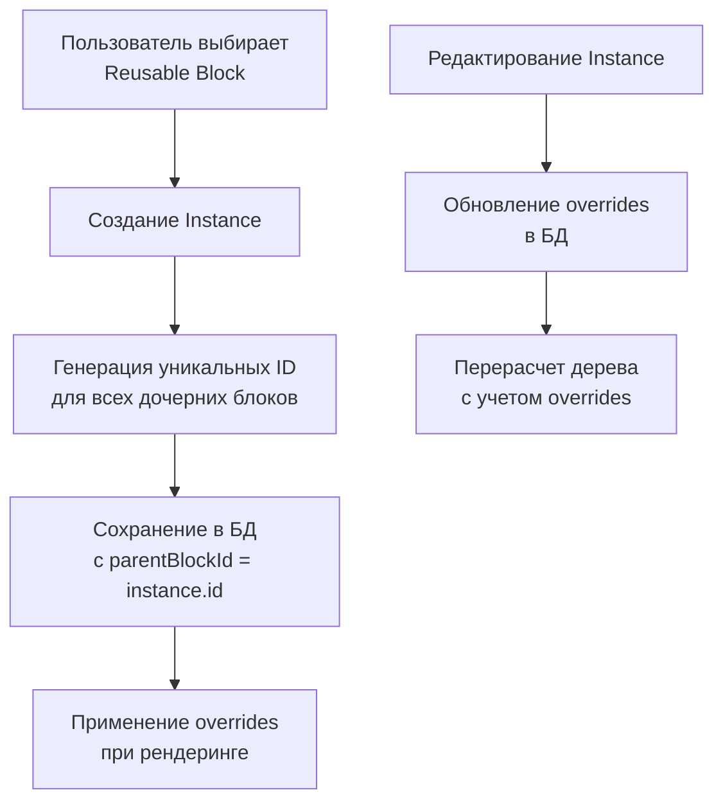
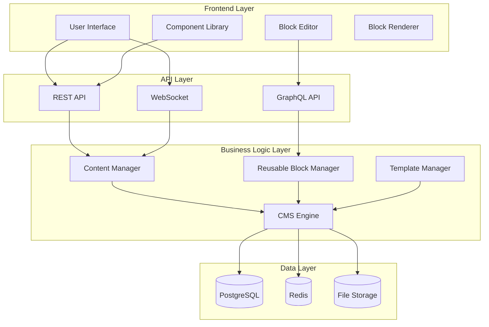
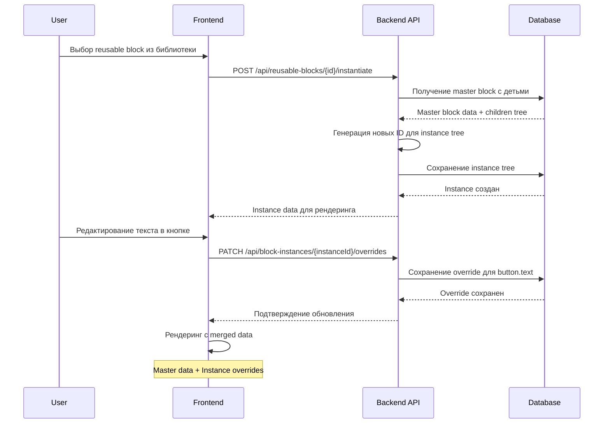

# 🏗️ Архитектурный Обзор и План Модернизации CMS

## 📋 Содержание
1. [Аудит Текущей Архитектуры](#-аудит-текущей-архитектуры)
2. [Анализ Существующей Системы Блоков](#-анализ-существующей-системы-блоков)
3. [План Модернизации](#-план-модернизации)
4. [Новая Концепция Иерархических Блоков](#-новая-концепция-иерархических-блоков)
5. [Архитектура Переиспользуемых Блоков](#-архитектура-переиспользуемых-блоков)
6. [Диаграммы и Поток Данных](#-диаграммы-и-поток-данных)
7. [Миграционная Стратегия](#-миграционная-стратегия)

---

## 🔍 Аудит Текущей Архитектуры

### Сильные Стороны Текущей Системы

1. **Модульная Архитектура**: Хорошо структурированная система с разделением ответственности
   - `CMSEngine` как центральный оркестратор
   - Отдельные менеджеры для контента, пользователей, шаблонов
   - Четкие интерфейсы между компонентами

2. **Поддержка Иерархии**: Базовая инфраструктура для вложенности уже существует
   - Поля `parent_block_id` и `slot` в таблице `layout_blocks`
   - Рекурсивный рендеринг в `BlockRenderer.tsx`
   - Система валидации размещения в `blockRegistry.ts`

3. **Гибкая Система Блоков**:
   - Централизованный реестр блоков с метаданными
   - Поддержка ленивой загрузки компонентов
   - Система редакторов для каждого типа блока
   - Zod-схемы для валидации данных

4. **Современный Стек**:
   - TypeScript для типобезопасности
   - React с современными паттернами
   - Supabase как BaaS решение
   - Система кеширования и оптимизаций

### Выявленные Недостатки

1. **Ограниченная Глубина Вложенности**:
   - Нет явной поддержки глубоких деревьев блоков
   - Отсутствует визуализация иерархии в интерфейсе
   - Сложность управления позициями в глубокой иерархии

2. **Отсутствие Переиспользуемых Компонентов**:
   - Нет возможности сохранять группы блоков как шаблоны
   - Отсутствует система инстанцирования с переопределениями
   - Нет библиотеки глобальных виджетов

3. **Проблемы Масштабируемости**:
   - Линейный рост сложности при увеличении количества блоков
   - Отсутствие оптимизаций для больших деревьев
   - Потенциальные проблемы с производительностью

---

## 🧩 Анализ Существующей Системы Блоков

### Текущая Структура Данных

```sql
-- layout_blocks table (упрощенная схема)
CREATE TABLE layout_blocks (
  id uuid PRIMARY KEY,
  page_identifier text NOT NULL,
  block_type text NOT NULL,
  content jsonb,                    -- данные блока
  position integer,                 -- позиция в родительском контейнере
  parent_block_id uuid,             -- ссылка на родителя
  slot text,                        -- имя слота в родителе
  status text,                      -- published/draft
  metadata jsonb                    -- дополнительные метаданные
);
```

### Существующая Иерархия

```typescript
// Текущая структура дерева в памяти
interface BlockNode {
  id: string;
  block_type: string;
  content: any;
  position: number;
  parent_block_id: string | null;
  slot: string | null;
  children: BlockNode[];  // вычисляется рекурсивно
}
```

### Проблемы Текущей Реализации

1. **Производительность**: Рекурсивный обход дерева при каждом рендере
2. **Кеширование**: Сложность инвалидации кеша для частичных обновлений
3. **Валидация**: Отсутствие комплексной проверки целостности дерева
4. **UI/UX**: Недостаточная визуализация иерархии для пользователей

---

## 🚀 План Модернизации

### Фаза 1: Улучшение Иерархической Системы

#### 1.1 Оптимизация Структуры Данных
- Введение индексов для быстрого поиска по `parent_block_id`
- Добавление поля `depth` для предотвращения бесконечной рекурсии
- Оптимизация запросов с использованием CTE (Common Table Expressions)

#### 1.2 Улучшение Рендеринга
- Реализация виртуализации для больших деревьев
- Ленивая загрузка дочерних блоков
- Оптимизация перерисовок с помощью React.memo

#### 1.3 Улучшение UX
- Визуализация иерархии в дереве навигации
- Drag & Drop с учетом вложенности
- Контекстные меню для операций с деревом

### Фаза 2: Система Переиспользуемых Блоков

#### 2.1 Новая Архитектура
```
ReusableBlock (шаблон)
├── Master Content (оригинальные данные)
├── Metadata (название, описание, теги)
├── Version History (история изменений)
└── Instances (экземпляры на страницах)
    ├── Instance 1 (со своими overrides)
    ├── Instance 2 (со своими overrides)
    └── ...
```

#### 2.2 Механизм Overrides
- Глубокое слияние данных (deep merge)
- Поддержка частичных переопределений
- Каскадное наследование свойств

#### 2.3 Библиотека Компонентов
- Категоризация и поиск
- Превью компонентов
- Управление версиями

### Фаза 3: Интеграция и Оптимизации

#### 3.1 API Оптимизации
- GraphQL для эффективных запросов деревьев
- WebSocket для realtime синхронизации
- Кеширование с инвалидацией по дереву

#### 3.2 Производительность
- Database-level оптимизации
- Frontend виртуализация
- CDN для статических ресурсов

---

## 🌳 Новая Концепция Иерархических Блоков

### Уровни Абстракции

```
┌─────────────────────────────────────────────────────────────┐
│                    PAGE LEVEL                               │
│  ┌─────────────────────────────────────────────────────┐   │
│  │              SECTION LEVEL                           │   │
│  │  ┌─────────────────────────────────────────────────┐ │   │
│  │  │          CONTAINER LEVEL                         │ │   │
│  │  │  ┌─────────────────────────────────────────────┐ │ │   │
│  │  │  │      COMPONENT LEVEL                        │ │ │   │
│  │  │  │  ┌─────────────────────────────────────────┐ │ │ │   │
│  │  │  │  │   ELEMENT LEVEL                         │ │ │ │   │
│  │  │  │  │  ┌─────────────────────────────────────┐ │ │ │ │   │
│  │  │  │  │  │  ATOMIC LEVEL                       │ │ │ │ │   │
│  │  │  │  │  │  [Text] [Button] [Image] [Spacer]   │ │ │ │ │   │
│  │  │  │  │  └─────────────────────────────────────┘ │ │ │ │   │
│  │  │  │  └─────────────────────────────────────────┘ │ │ │   │
│  │  │  └─────────────────────────────────────────────┘ │ │   │
│  │  └─────────────────────────────────────────────────┘ │   │
│  └─────────────────────────────────────────────────────┘   │
└─────────────────────────────────────────────────────────────┘
```

### Типы Блоков в Новой Архитектуре

#### 1. **Атомарные Блоки** (Leaf Nodes)
```typescript
interface AtomicBlock {
  type: 'heading' | 'paragraph' | 'image' | 'button' | 'spacer';
  content: AtomicContent;
  canHaveChildren: false;
}
```

#### 2. **Контейнерные Блоки** (Container Nodes)
```typescript
interface ContainerBlock {
  type: 'section' | 'container' | 'tabs' | 'accordion';
  content: ContainerContent;
  canHaveChildren: true;
  allowedChildren: string[];
  allowedSlots: string[];
  children: BlockNode[];
}
```

#### 3. **Переиспользуемые Блоки** (Reusable Nodes)
```typescript
interface ReusableBlock {
  type: 'reusable_instance';
  content: InstanceContent;
  masterBlockId: string;
  overrides: OverrideMap;
  canHaveChildren: false;  // инстансы не имеют прямых детей
}
```

---

## 🔄 Архитектура Переиспользуемых Блоков

### Основные Компоненты

#### 1. **Master Block** (Шаблон)
```typescript
interface MasterBlock {
  id: string;
  name: string;
  description: string;
  category: string;
  tags: string[];
  content: MasterContent;
  children: BlockNode[];
  version: number;
  createdBy: string;
  createdAt: Date;
  updatedAt: Date;
}
```

#### 2. **Block Instance** (Экземпляр)
```typescript
interface BlockInstance {
  id: string;
  masterBlockId: string;
  pageId: string;
  position: number;
  parentBlockId: string | null;
  slot: string | null;
  overrides: OverrideMap;
  createdAt: Date;
}
```

#### 3. **Override System** (Система Переопределений)
```typescript
interface OverrideMap {
  [blockId: string]: {
    [propertyPath: string]: any;
  };
}

// Пример переопределения
const overrides = {
  "button-1": {
    "text": "Новый текст кнопки",
    "link": "/new-link",
    "style.variant": "secondary"
  },
  "image-1": {
    "src": "https://new-image.jpg",
    "alt": "Новое описание"
  }
};
```

### Процесс Инстанцирования



---

## 📊 Диаграммы и Поток Данных

### Архитектура Системы



### Поток Данных для Переиспользуемых Блоков



---

## 🔄 Миграционная Стратегия

### Этапы Миграции

#### Этап 1: Подготовка (1-2 недели)
1. Анализ существующей базы данных
2. Создание бэкапов критически важных данных
3. Разработка скриптов миграции
4. Тестирование миграции на staging окружении

#### Этап 2: Миграция Базы Данных (1 неделя)
1. Создание новых таблиц для reusable blocks
2. Миграция существующих блоков
3. Обновление индексов и ограничений
4. Валидация целостности данных

#### Этап 3: Backend Модернизация (2-3 недели)
1. Обновление API эндпоинтов
2. Реализация менеджера reusable blocks
3. Обновление системы кеширования
4. Добавление валидации для новой структуры

#### Этап 4: Frontend Модернизация (2-3 недели)
1. Обновление компонентов рендеринга
2. Реализация UI для библиотеки компонентов
3. Добавление системы overrides в редактор
4. Оптимизация производительности

#### Этап 5: Тестирование и Оптимизация (1-2 недели)
1. Интеграционное тестирование
2. Performance тестирование
3. User acceptance testing
4. Production deployment

### Риски и Меры Предосторожности

1. **Потеря Данных**: Полные бэкапы перед каждой миграцией
2. **Простои**: Поэтапное развертывание с fallback
3. **Производительность**: Постепенное увеличение нагрузки на staging
4. **Регрессии**: Автоматизированные тесты для критических сценариев

### Rollback Стратегия

1. **Быстрый Rollback**: Возможность отката к предыдущей версии в течение 24 часов
2. **Пошаговый Rollback**: Возможность отката отдельных компонентов
3. **Data Rollback**: Восстановление из бэкапов при необходимости

---

## 🎯 Заключение

Предложенная модернизация представляет собой комплексное решение для внедрения современных функций CMS:

- **Иерархическая система блоков** с оптимизированным рендерингом
- **Система переиспользуемых компонентов** с мощной системой overrides
- **Масштабируемая архитектура** с учетом будущих требований
- **Современный пользовательский опыт** с интуитивным интерфейсом

Реализация данного плана позволит создать конкурентоспособную CMS с функциональностью уровня Elementor/Webflow/Tilda, сохранив при этом преимущества существующей кодовой базы.
