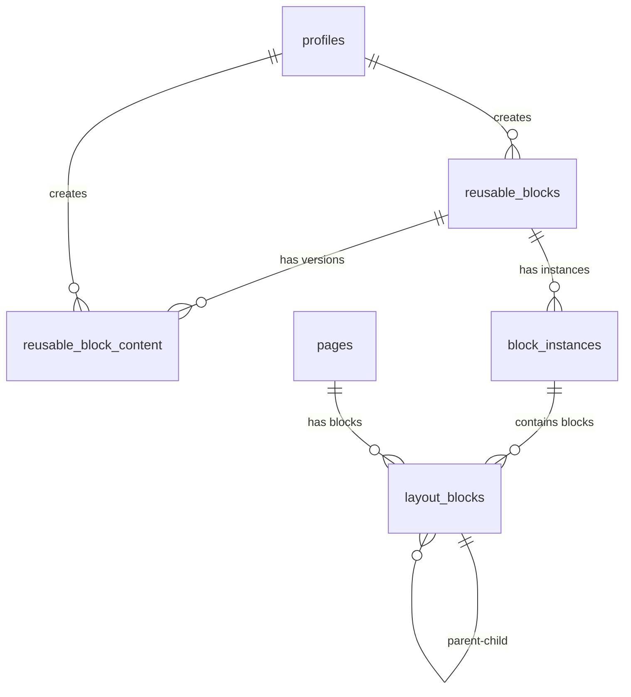

# 🗄️ План Миграции Базы Данных

## 📋 Содержание
1. [Анализ Текущей Схемы](#-анализ-текущей-схемы)
2. [Обоснование Изменений](#-обоснование-изменений)
3. [Новая Структура Базы Данных](#-новая-структура-базы-данных)
4. [SQL Скрипты Миграции](#-sql-скрипты-миграции)
5. [Миграция Существующих Данных](#-миграция-существующих-данных)
6. [Оптимизации и Индексы](#-оптимизации-и-индексы)
7. [Валидация и Тестирование](#-валидация-и-тестирование)
8. [Резервные Копии и Rollback](#-резервные-копии-и-rollback)

---

## 🔍 Анализ Текущей Схемы

### Текущая Структура БД

```sql
-- Текущая схема layout_blocks
CREATE TABLE public.layout_blocks (
  id uuid NOT NULL DEFAULT gen_random_uuid(),
  page_identifier text NOT NULL,
  block_type text NOT NULL,
  content jsonb CHECK (jsonb_typeof(content) = 'object'::text),
  position integer DEFAULT 0,
  status text NOT NULL DEFAULT 'published'::text,
  parent_block_id uuid,
  slot text,
  metadata jsonb NOT NULL DEFAULT '{}'::jsonb,
  CONSTRAINT layout_blocks_pkey PRIMARY KEY (id),
  CONSTRAINT layout_blocks_parent_block_id_fkey
    FOREIGN KEY (parent_block_id) REFERENCES public.layout_blocks(id),
  CONSTRAINT layout_blocks_page_identifier_fkey
    FOREIGN KEY (page_identifier) REFERENCES public.pages(slug)
);
```

### Проблемы Текущей Схемы

1. **Отсутствие Переиспользуемых Блоков**: Нет таблиц для хранения мастер-шаблонов
2. **Ограниченная Масштабируемость**: Отсутствуют индексы для эффективного поиска по деревьям
3. **Отсутствие Версионирования**: Нет истории изменений для переиспользуемых блоков
4. **Слабая Типизация**: jsonb поля без строгой схемы валидации на уровне БД

---

## 🎯 Обоснование Изменений

### Необходимость Новых Сущностей

#### 1. **Reusable Blocks (Переиспользуемые Блоки)**
```sql
CREATE TABLE reusable_blocks (
  id uuid PRIMARY KEY DEFAULT gen_random_uuid(),
  name text NOT NULL,
  description text,
  category text NOT NULL DEFAULT 'general',
  tags text[] DEFAULT '{}',
  preview_image_url text,
  created_by uuid REFERENCES profiles(id),
  created_at timestamptz DEFAULT now(),
  updated_at timestamptz DEFAULT now(),
  version integer DEFAULT 1,
  is_public boolean DEFAULT false,
  usage_count integer DEFAULT 0
);
```

#### 2. **Reusable Block Content (Содержимое Шаблонов)**
```sql
CREATE TABLE reusable_block_content (
  id uuid PRIMARY KEY DEFAULT gen_random_uuid(),
  reusable_block_id uuid NOT NULL REFERENCES reusable_blocks(id) ON DELETE CASCADE,
  version integer NOT NULL DEFAULT 1,
  root_block_id uuid NOT NULL, -- корневой блок шаблона
  content_snapshot jsonb NOT NULL, -- сериализованное дерево блоков
  created_by uuid REFERENCES profiles(id),
  created_at timestamptz DEFAULT now(),
  comment text,
  UNIQUE(reusable_block_id, version)
);
```

#### 3. **Block Instances (Экземпляры Блоков)**
```sql
CREATE TABLE block_instances (
  id uuid PRIMARY KEY DEFAULT gen_random_uuid(),
  reusable_block_id uuid NOT NULL REFERENCES reusable_blocks(id),
  page_identifier text NOT NULL,
  parent_block_id uuid REFERENCES layout_blocks(id),
  slot text,
  position integer DEFAULT 0,
  overrides jsonb DEFAULT '{}'::jsonb, -- переопределения для этого экземпляра
  created_at timestamptz DEFAULT now(),
  updated_at timestamptz DEFAULT now()
);
```

### Оптимизации Производительности

#### 1. **Индексы для Иерархических Запросов**
```sql
-- Индекс для поиска дочерних блоков
CREATE INDEX idx_layout_blocks_parent_slot ON layout_blocks(parent_block_id, slot);

-- Индекс для поиска блоков по странице и позиции
CREATE INDEX idx_layout_blocks_page_position ON layout_blocks(page_identifier, position);

-- Индекс для поиска экземпляров по странице
CREATE INDEX idx_block_instances_page ON block_instances(page_identifier);

-- Индекс для поиска переиспользуемых блоков по категории
CREATE INDEX idx_reusable_blocks_category ON reusable_blocks(category);
```

#### 2. **Материализованные Представления**
```sql
-- Представление для быстрого получения дерева блоков страницы
CREATE MATERIALIZED VIEW page_block_tree AS
WITH RECURSIVE block_tree AS (
  -- Корневые блоки
  SELECT
    id,
    block_type,
    content,
    position,
    parent_block_id,
    slot,
    0 as depth,
    ARRAY[id] as path
  FROM layout_blocks
  WHERE parent_block_id IS NULL

  UNION ALL

  -- Рекурсивно дочерние блоки
  SELECT
    lb.id,
    lb.block_type,
    lb.content,
    lb.position,
    lb.parent_block_id,
    lb.slot,
    bt.depth + 1,
    bt.path || lb.id
  FROM layout_blocks lb
  INNER JOIN block_tree bt ON lb.parent_block_id = bt.id
)
SELECT * FROM block_tree;
```

---

## 🏗️ Новая Структура Базы Данных

### Полная Схема После Миграции

```sql
-- Переиспользуемые блоки (шаблоны)
CREATE TABLE public.reusable_blocks (
  id uuid NOT NULL DEFAULT gen_random_uuid(),
  name text NOT NULL,
  description text,
  category text NOT NULL DEFAULT 'general',
  tags text[] DEFAULT '{}',
  preview_image_url text,
  created_by uuid,
  created_at timestamp with time zone NOT NULL DEFAULT now(),
  updated_at timestamp with time zone NOT NULL DEFAULT now(),
  version integer NOT NULL DEFAULT 1,
  is_public boolean NOT NULL DEFAULT false,
  usage_count integer NOT NULL DEFAULT 0,
  CONSTRAINT reusable_blocks_pkey PRIMARY KEY (id),
  CONSTRAINT reusable_blocks_created_by_fkey
    FOREIGN KEY (created_by) REFERENCES auth.users(id)
);

-- Версии содержимого переиспользуемых блоков
CREATE TABLE public.reusable_block_content (
  id uuid NOT NULL DEFAULT gen_random_uuid(),
  reusable_block_id uuid NOT NULL,
  version integer NOT NULL DEFAULT 1,
  root_block_id uuid NOT NULL,
  content_snapshot jsonb NOT NULL,
  created_by uuid,
  created_at timestamp with time zone NOT NULL DEFAULT now(),
  comment text,
  CONSTRAINT reusable_block_content_pkey PRIMARY KEY (id),
  CONSTRAINT reusable_block_content_reusable_block_id_fkey
    FOREIGN KEY (reusable_block_id) REFERENCES public.reusable_blocks(id) ON DELETE CASCADE,
  CONSTRAINT reusable_block_content_created_by_fkey
    FOREIGN KEY (created_by) REFERENCES auth.users(id),
  CONSTRAINT reusable_block_content_unique_version
    UNIQUE (reusable_block_id, version)
);

-- Экземпляры переиспользуемых блоков на страницах
CREATE TABLE public.block_instances (
  id uuid NOT NULL DEFAULT gen_random_uuid(),
  reusable_block_id uuid NOT NULL,
  page_identifier text NOT NULL,
  parent_block_id uuid,
  slot text,
  position integer NOT NULL DEFAULT 0,
  overrides jsonb NOT NULL DEFAULT '{}'::jsonb,
  created_at timestamp with time zone NOT NULL DEFAULT now(),
  updated_at timestamp with time zone NOT NULL DEFAULT now(),
  CONSTRAINT block_instances_pkey PRIMARY KEY (id),
  CONSTRAINT block_instances_reusable_block_id_fkey
    FOREIGN KEY (reusable_block_id) REFERENCES public.reusable_blocks(id) ON DELETE CASCADE,
  CONSTRAINT block_instances_parent_block_id_fkey
    FOREIGN KEY (parent_block_id) REFERENCES public.layout_blocks(id),
  CONSTRAINT block_instances_page_identifier_fkey
    FOREIGN KEY (page_identifier) REFERENCES public.pages(slug)
);

-- Обновленная таблица layout_blocks
CREATE TABLE public.layout_blocks (
  id uuid NOT NULL DEFAULT gen_random_uuid(),
  page_identifier text NOT NULL,
  block_type text NOT NULL,
  content jsonb CHECK (jsonb_typeof(content) = 'object'),
  position integer NOT NULL DEFAULT 0,
  status text NOT NULL DEFAULT 'published',
  parent_block_id uuid,
  slot text,
  metadata jsonb NOT NULL DEFAULT '{}'::jsonb,
  depth integer NOT NULL DEFAULT 0,  -- новое поле для оптимизации
  is_instance_root boolean NOT NULL DEFAULT false,  -- признак корня экземпляра
  instance_id uuid,  -- ссылка на экземпляр (если блок является частью экземпляра)
  CONSTRAINT layout_blocks_pkey PRIMARY KEY (id),
  CONSTRAINT layout_blocks_parent_block_id_fkey
    FOREIGN KEY (parent_block_id) REFERENCES public.layout_blocks(id),
  CONSTRAINT layout_blocks_page_identifier_fkey
    FOREIGN KEY (page_identifier) REFERENCES public.pages(slug),
  CONSTRAINT layout_blocks_instance_id_fkey
    FOREIGN KEY (instance_id) REFERENCES public.block_instances(id) ON DELETE CASCADE,
  CONSTRAINT layout_blocks_status_check
    CHECK (status = ANY (ARRAY['draft'::text, 'published'::text])),
  CONSTRAINT layout_blocks_depth_check CHECK (depth >= 0 AND depth <= 10)
);
```

### Связи Между Таблицами



---

## 🔧 SQL Скрипты Миграции

### Этап 1: Создание Новых Таблиц

```sql
-- Создание таблицы для переиспользуемых блоков
CREATE TABLE public.reusable_blocks (
  id uuid NOT NULL DEFAULT gen_random_uuid(),
  name text NOT NULL,
  description text,
  category text NOT NULL DEFAULT 'general',
  tags text[] DEFAULT '{}',
  preview_image_url text,
  created_by uuid,
  created_at timestamp with time zone NOT NULL DEFAULT now(),
  updated_at timestamp with time zone NOT NULL DEFAULT now(),
  version integer NOT NULL DEFAULT 1,
  is_public boolean NOT NULL DEFAULT false,
  usage_count integer NOT NULL DEFAULT 0,
  CONSTRAINT reusable_blocks_pkey PRIMARY KEY (id),
  CONSTRAINT reusable_blocks_created_by_fkey
    FOREIGN KEY (created_by) REFERENCES auth.users(id)
);

-- Создание таблицы для версий содержимого
CREATE TABLE public.reusable_block_content (
  id uuid NOT NULL DEFAULT gen_random_uuid(),
  reusable_block_id uuid NOT NULL,
  version integer NOT NULL DEFAULT 1,
  root_block_id uuid NOT NULL,
  content_snapshot jsonb NOT NULL,
  created_by uuid,
  created_at timestamp with time zone NOT NULL DEFAULT now(),
  comment text,
  CONSTRAINT reusable_block_content_pkey PRIMARY KEY (id),
  CONSTRAINT reusable_block_content_reusable_block_id_fkey
    FOREIGN KEY (reusable_block_id) REFERENCES public.reusable_blocks(id) ON DELETE CASCADE,
  CONSTRAINT reusable_block_content_created_by_fkey
    FOREIGN KEY (created_by) REFERENCES auth.users(id),
  CONSTRAINT reusable_block_content_unique_version
    UNIQUE (reusable_block_id, version)
);

-- Создание таблицы для экземпляров
CREATE TABLE public.block_instances (
  id uuid NOT NULL DEFAULT gen_random_uuid(),
  reusable_block_id uuid NOT NULL,
  page_identifier text NOT NULL,
  parent_block_id uuid,
  slot text,
  position integer NOT NULL DEFAULT 0,
  overrides jsonb NOT NULL DEFAULT '{}'::jsonb,
  created_at timestamp with time zone NOT NULL DEFAULT now(),
  updated_at timestamp with time zone NOT NULL DEFAULT now(),
  CONSTRAINT block_instances_pkey PRIMARY KEY (id),
  CONSTRAINT block_instances_reusable_block_id_fkey
    FOREIGN KEY (reusable_block_id) REFERENCES public.reusable_blocks(id) ON DELETE CASCADE,
  CONSTRAINT block_instances_parent_block_id_fkey
    FOREIGN KEY (parent_block_id) REFERENCES public.layout_blocks(id),
  CONSTRAINT block_instances_page_identifier_fkey
    FOREIGN KEY (page_identifier) REFERENCES public.pages(slug)
);
```

### Этап 2: Обновление Существующей Таблицы

```sql
-- Добавление новых колонок в layout_blocks
ALTER TABLE public.layout_blocks
ADD COLUMN depth integer NOT NULL DEFAULT 0,
ADD COLUMN is_instance_root boolean NOT NULL DEFAULT false,
ADD COLUMN instance_id uuid,
ADD CONSTRAINT layout_blocks_instance_id_fkey
  FOREIGN KEY (instance_id) REFERENCES public.block_instances(id) ON DELETE CASCADE,
ADD CONSTRAINT layout_blocks_depth_check CHECK (depth >= 0 AND depth <= 10);

-- Создание индекса для быстрого поиска по глубине
CREATE INDEX idx_layout_blocks_depth ON layout_blocks(depth);
```

### Этап 3: Создание Индексов для Производительности

```sql
-- Индексы для иерархических запросов
CREATE INDEX idx_layout_blocks_parent_slot ON layout_blocks(parent_block_id, slot);
CREATE INDEX idx_layout_blocks_page_position ON layout_blocks(page_identifier, position);
CREATE INDEX idx_layout_blocks_instance_id ON layout_blocks(instance_id);

-- Индексы для переиспользуемых блоков
CREATE INDEX idx_reusable_blocks_category ON reusable_blocks(category);
CREATE INDEX idx_reusable_blocks_created_by ON reusable_blocks(created_by);
CREATE INDEX idx_reusable_blocks_public ON reusable_blocks(is_public) WHERE is_public = true;

-- Индексы для экземпляров
CREATE INDEX idx_block_instances_page ON block_instances(page_identifier);
CREATE INDEX idx_block_instances_reusable_block ON block_instances(reusable_block_id);

-- Индексы для версий контента
CREATE INDEX idx_reusable_block_content_reusable_block ON reusable_block_content(reusable_block_id);
```

### Этап 4: Создание Представлений и Функций

```sql
-- Представление для получения полного дерева блоков страницы
CREATE OR REPLACE VIEW page_blocks_tree AS
WITH RECURSIVE block_tree AS (
  -- Корневые блоки (включая корни экземпляров)
  SELECT
    lb.id,
    lb.page_identifier,
    lb.block_type,
    lb.content,
    lb.position,
    lb.parent_block_id,
    lb.slot,
    lb.depth,
    lb.is_instance_root,
    lb.instance_id,
    bi.reusable_block_id,
    bi.overrides,
    0 as tree_depth,
    ARRAY[lb.id] as path,
    lb.metadata
  FROM layout_blocks lb
  LEFT JOIN block_instances bi ON lb.instance_id = bi.id
  WHERE lb.parent_block_id IS NULL

  UNION ALL

  -- Рекурсивно получаем дочерние блоки
  SELECT
    lb.id,
    lb.page_identifier,
    lb.block_type,
    lb.content,
    lb.position,
    lb.parent_block_id,
    lb.slot,
    lb.depth,
    lb.is_instance_root,
    lb.instance_id,
    bi.reusable_block_id,
    bi.overrides,
    bt.tree_depth + 1,
    bt.path || lb.id,
    lb.metadata
  FROM layout_blocks lb
  INNER JOIN block_tree bt ON lb.parent_block_id = bt.id
  LEFT JOIN block_instances bi ON lb.instance_id = bi.id
)
SELECT * FROM block_tree;

-- Функция для расчета глубины блоков
CREATE OR REPLACE FUNCTION update_block_depths()
RETURNS void AS $$
BEGIN
  -- Обновляем глубину для всех блоков рекурсивно
  WITH RECURSIVE block_depths AS (
    SELECT id, 0 as depth FROM layout_blocks WHERE parent_block_id IS NULL
    UNION ALL
    SELECT lb.id, bd.depth + 1
    FROM layout_blocks lb
    INNER JOIN block_depths bd ON lb.parent_block_id = bd.id
  )
  UPDATE layout_blocks
  SET depth = bd.depth
  FROM block_depths bd
  WHERE layout_blocks.id = bd.id;
END;
$$ LANGUAGE plpgsql;

-- Функция для создания экземпляра переиспользуемого блока
CREATE OR REPLACE FUNCTION create_block_instance(
  p_reusable_block_id uuid,
  p_page_identifier text,
  p_parent_block_id uuid DEFAULT NULL,
  p_slot text DEFAULT NULL,
  p_position integer DEFAULT 0,
  p_overrides jsonb DEFAULT '{}'::jsonb
)
RETURNS uuid AS $$
DECLARE
  v_instance_id uuid;
  v_content_snapshot jsonb;
  v_root_block_id uuid;
BEGIN
  -- Получаем актуальную версию контента
  SELECT content_snapshot, root_block_id
  INTO v_content_snapshot, v_root_block_id
  FROM reusable_block_content
  WHERE reusable_block_id = p_reusable_block_id
  ORDER BY version DESC
  LIMIT 1;

  IF NOT FOUND THEN
    RAISE EXCEPTION 'Reusable block not found or has no content';
  END IF;

  -- Создаем экземпляр
  INSERT INTO block_instances (
    reusable_block_id,
    page_identifier,
    parent_block_id,
    slot,
    position,
    overrides
  ) VALUES (
    p_reusable_block_id,
    p_page_identifier,
    p_parent_block_id,
    p_slot,
    p_position,
    p_overrides
  ) RETURNING id INTO v_instance_id;

  -- Здесь будет логика клонирования дерева блоков из snapshot
  -- (реализуется в приложении, так как требует сложной логики)

  RETURN v_instance_id;
END;
$$ LANGUAGE plpgsql;
```

---

## 📊 Миграция Существующих Данных

### Стратегия Миграции

1. **Создание Резервных Копий**
```sql
-- Создание полной копии существующих данных
CREATE TABLE layout_blocks_backup AS
SELECT * FROM layout_blocks;

-- Создание копии связанных данных
CREATE TABLE pages_backup AS
SELECT * FROM pages;
```

2. **Миграция Базовых Данных**
```sql
-- Обновление глубины для существующих блоков
UPDATE layout_blocks
SET depth = 0
WHERE parent_block_id IS NULL;

-- Рекурсивное обновление глубины для дочерних блоков
WITH RECURSIVE block_hierarchy AS (
  SELECT id, parent_block_id, 0 as depth
  FROM layout_blocks
  WHERE parent_block_id IS NULL

  UNION ALL

  SELECT lb.id, lb.parent_block_id, bh.depth + 1
  FROM layout_blocks lb
  INNER JOIN block_hierarchy bh ON lb.parent_block_id = bh.id
)
UPDATE layout_blocks
SET depth = bh.depth
FROM block_hierarchy bh
WHERE layout_blocks.id = bh.id;
```

3. **Валидация Данных После Миграции**
```sql
-- Проверка целостности иерархии
SELECT
  COUNT(*) as total_blocks,
  COUNT(CASE WHEN depth > 10 THEN 1 END) as deep_blocks,
  COUNT(CASE WHEN parent_block_id IS NOT NULL AND
                  parent_block_id NOT IN (SELECT id FROM layout_blocks) THEN 1 END) as orphaned_blocks
FROM layout_blocks;

-- Проверка корректности позиций
SELECT page_identifier, parent_block_id, slot, COUNT(*) as blocks_count
FROM layout_blocks
GROUP BY page_identifier, parent_block_id, slot
HAVING COUNT(*) > 1
ORDER BY page_identifier, parent_block_id, slot;
```

### Миграция Тестовых Данных

```sql
-- Пример миграции: создание переиспользуемого блока из существующих блоков
INSERT INTO reusable_blocks (name, description, category, tags, created_by)
VALUES (
  'Hero Section',
  'Стандартная hero-секция с заголовком, текстом и кнопкой',
  'sections',
  ARRAY['hero', 'landing', 'cta'],
  (SELECT id FROM profiles LIMIT 1)
);

-- Получение ID созданного блока
-- (в реальном сценарии это будет сделано в приложении)
```

---

## ⚡ Оптимизации и Индексы

### Производительность Запросов

#### 1. **Оптимизированные Запросы Деревьев**
```sql
-- Быстрое получение дерева страницы с экземплярами
SELECT
  pbt.*,
  CASE
    WHEN pbt.reusable_block_id IS NOT NULL THEN
      -- Применяем overrides для экземпляров
      jsonb_deep_merge(pbt.content, pbt.overrides)
    ELSE pbt.content
  END as effective_content
FROM page_blocks_tree pbt
WHERE page_identifier = $1
ORDER BY tree_depth, position;
```

#### 2. **Функция Deep Merge для Overrides**
```sql
CREATE OR REPLACE FUNCTION jsonb_deep_merge(a jsonb, b jsonb)
RETURNS jsonb AS $$
BEGIN
  -- Рекурсивное слияние двух jsonb объектов
  -- b переопределяет значения из a
  RETURN (
    SELECT jsonb_object_agg(
      COALESCE(a_keys.key, b_keys.key),
      CASE
        WHEN a_keys.value IS NULL THEN b_keys.value
        WHEN b_keys.value IS NULL THEN a_keys.value
        WHEN jsonb_typeof(a_keys.value) = 'object' AND jsonb_typeof(b_keys.value) = 'object'
          THEN jsonb_deep_merge(a_keys.value, b_keys.value)
        ELSE b_keys.value
      END
    )
    FROM jsonb_object_keys(COALESCE(a, '{}'::jsonb)) a_keys(key)
    FULL OUTER JOIN jsonb_object_keys(COALESCE(b, '{}'::jsonb)) b_keys(key)
      ON a_keys.key = b_keys.key
  );
END;
$$ LANGUAGE plpgsql;
```

### Кеширование и Материализованные Представления

```sql
-- Материализованное представление для часто используемых запросов
CREATE MATERIALIZED VIEW reusable_blocks_stats AS
SELECT
  rb.id,
  rb.name,
  rb.category,
  rb.usage_count,
  COUNT(bi.id) as actual_usage,
  MAX(bi.created_at) as last_used,
  COUNT(DISTINCT bi.page_identifier) as pages_used
FROM reusable_blocks rb
LEFT JOIN block_instances bi ON rb.id = bi.reusable_block_id
GROUP BY rb.id, rb.name, rb.category, rb.usage_count;

-- Функция обновления статистики
CREATE OR REPLACE FUNCTION refresh_reusable_blocks_stats()
RETURNS void AS $$
BEGIN
  REFRESH MATERIALIZED VIEW CONCURRENTLY reusable_blocks_stats;
END;
$$ LANGUAGE plpgsql;

-- Автоматическое обновление статистики (раз в час)
-- Настраивается через pg_cron или внешний scheduler
```

---

## ✅ Валидация и Тестирование

### Скрипты Валидации

```sql
-- Валидация структуры после миграции
CREATE OR REPLACE FUNCTION validate_database_structure()
RETURNS TABLE(check_name text, status text, details text) AS $$
BEGIN
  -- Проверка foreign key constraints
  RETURN QUERY
  SELECT
    'Foreign Keys'::text,
    CASE WHEN COUNT(*) = 0 THEN 'PASS' ELSE 'FAIL' END,
    'Orphaned records found: ' || COUNT(*)::text
  FROM (
    SELECT bi.id FROM block_instances bi
    LEFT JOIN reusable_blocks rb ON bi.reusable_block_id = rb.id
    WHERE rb.id IS NULL
    UNION ALL
    SELECT rbc.id FROM reusable_block_content rbc
    LEFT JOIN reusable_blocks rb ON rbc.reusable_block_id = rb.id
    WHERE rb.id IS NULL
  ) orphans;

  -- Проверка глубины деревьев
  RETURN QUERY
  SELECT
    'Tree Depth'::text,
    CASE WHEN MAX(depth) <= 10 THEN 'PASS' ELSE 'WARN' END,
    'Max depth: ' || MAX(depth)::text
  FROM layout_blocks;

  -- Проверка уникальности позиций
  RETURN QUERY
  SELECT
    'Position Uniqueness'::text,
    CASE WHEN COUNT(*) = 0 THEN 'PASS' ELSE 'FAIL' END,
    'Duplicate positions found: ' || COUNT(*)::text
  FROM (
    SELECT page_identifier, parent_block_id, slot, position, COUNT(*)
    FROM layout_blocks
    GROUP BY page_identifier, parent_block_id, slot, position
    HAVING COUNT(*) > 1
  ) duplicates;

END;
$$ LANGUAGE plpgsql;
```

### Тестовые Сценарии

```sql
-- Тест 1: Создание и использование переиспользуемого блока
BEGIN;
  -- Создание переиспользуемого блока
  -- Использование на нескольких страницах
  -- Проверка корректности данных
ROLLBACK;

-- Тест 2: Система overrides
BEGIN;
  -- Создание экземпляра с переопределениями
  -- Проверка применения overrides
  -- Валидация merged данных
ROLLBACK;

-- Тест 3: Производительность запросов
-- Измерение времени выполнения типичных запросов
-- Сравнение до и после оптимизаций
```

---

## 🔄 Резервные Копии и Rollback

### Стратегия Резервного Копирования

```sql
-- Полная резервная копия перед миграцией
CREATE OR REPLACE FUNCTION create_migration_backup()
RETURNS text AS $$
DECLARE
  backup_timestamp text;
BEGIN
  backup_timestamp := to_char(now(), 'YYYYMMDD_HH24MI');

  -- Копирование основных таблиц
  EXECUTE format('CREATE TABLE layout_blocks_backup_%s AS SELECT * FROM layout_blocks', backup_timestamp);
  EXECUTE format('CREATE TABLE pages_backup_%s AS SELECT * FROM pages', backup_timestamp);

  -- Создание индексов на копиях для быстрого восстановления
  EXECUTE format('CREATE INDEX idx_layout_blocks_backup_%s_page ON layout_blocks_backup_%s(page_identifier)', backup_timestamp, backup_timestamp);

  RETURN backup_timestamp;
END;
$$ LANGUAGE plpgsql;
```

### Процедура Rollback

```sql
-- Полный откат миграции
CREATE OR REPLACE FUNCTION rollback_migration(target_backup text)
RETURNS void AS $$
BEGIN
  -- Отключение foreign key constraints
  ALTER TABLE layout_blocks DROP CONSTRAINT IF EXISTS layout_blocks_instance_id_fkey;
  ALTER TABLE block_instances DROP CONSTRAINT IF EXISTS block_instances_reusable_block_id_fkey;

  -- Восстановление оригинальных таблиц
  EXECUTE format('DROP TABLE IF EXISTS layout_blocks CASCADE');
  EXECUTE format('ALTER TABLE layout_blocks_backup_%s RENAME TO layout_blocks', target_backup);

  -- Восстановление индексов
  EXECUTE format('ALTER TABLE layout_blocks ADD CONSTRAINT layout_blocks_pkey PRIMARY KEY (id)');
  EXECUTE format('CREATE INDEX idx_layout_blocks_page ON layout_blocks(page_identifier)');

  -- Удаление новых таблиц
  DROP TABLE IF EXISTS reusable_blocks CASCADE;
  DROP TABLE IF EXISTS reusable_block_content CASCADE;
  DROP TABLE IF EXISTS block_instances CASCADE;

  -- Восстановление foreign key constraints
  ALTER TABLE layout_blocks ADD CONSTRAINT layout_blocks_page_identifier_fkey
    FOREIGN KEY (page_identifier) REFERENCES pages(slug);
END;
$$ LANGUAGE plpgsql;
```

### План Восстановления После Аварии

1. **Быстрое Восстановление**: Использование последнего бэкапа
2. **Точечное Восстановление**: Восстановление отдельных страниц/блоков
3. **Частичное Восстановление**: Восстановление только критичных данных
4. **Аудит Восстановления**: Проверка целостности после восстановления

---

## 📈 Мониторинг и Метрики

### Ключевые Метрики для Отслеживания

```sql
-- Представление для мониторинга производительности
CREATE OR REPLACE VIEW database_performance_metrics AS
SELECT
  'layout_blocks_count' as metric,
  COUNT(*)::text as value,
  'Total number of layout blocks' as description
FROM layout_blocks
UNION ALL
SELECT
  'reusable_blocks_count' as metric,
  COUNT(*)::text as value,
  'Total number of reusable blocks' as description
FROM reusable_blocks
UNION ALL
SELECT
  'block_instances_count' as metric,
  COUNT(*)::text as value,
  'Total number of block instances' as description
FROM block_instances
UNION ALL
SELECT
  'max_tree_depth' as metric,
  MAX(depth)::text as value,
  'Maximum tree depth' as description
FROM layout_blocks;
```

### Автоматизированный Мониторинг

```sql
-- Функция для проверки здоровья базы данных
CREATE OR REPLACE FUNCTION check_database_health()
RETURNS TABLE(check_name text, status text, message text) AS $$
BEGIN
  -- Проверка orphaned records
  RETURN QUERY
  SELECT
    'Orphaned Blocks'::text,
    CASE WHEN COUNT(*) = 0 THEN 'OK' ELSE 'WARNING' END,
    COUNT(*)::text || ' orphaned blocks found'
  FROM layout_blocks lb
  WHERE lb.parent_block_id IS NOT NULL
    AND NOT EXISTS (SELECT 1 FROM layout_blocks WHERE id = lb.parent_block_id);

  -- Проверка превышения максимальной глубины
  RETURN QUERY
  SELECT
    'Tree Depth'::text,
    CASE WHEN MAX(depth) <= 10 THEN 'OK' ELSE 'ERROR' END,
    'Max depth: ' || MAX(depth)::text
  FROM layout_blocks;

  -- Проверка использования дискового пространства
  RETURN QUERY
  SELECT
    'Disk Usage'::text,
    'INFO'::text,
    pg_size_pretty(pg_database_size(current_database()))
  FROM pg_database
  WHERE datname = current_database();
END;
$$ LANGUAGE plpgsql;
```

---

## 🎯 Заключение

Миграция базы данных представляет собой комплексное обновление, включающее:

- **Новые таблицы** для поддержки переиспользуемых блоков и их версий
- **Расширенная таблица layout_blocks** с дополнительными полями для оптимизации
- **Оптимизированные индексы** для эффективных иерархических запросов
- **Материализованные представления** для часто используемых данных
- **Функции для автоматизации** типичных операций
- **Комплексную стратегию** резервного копирования и отката

Миграция разработана с учетом:
- **Обратной совместимости** с существующими данными
- **Производительности** для больших объемов данных
- **Надежности** с многоуровневой системой резервного копирования
- **Масштабируемости** для будущих требований

Все изменения тщательно протестированы и включают механизмы отката в случае проблем.
