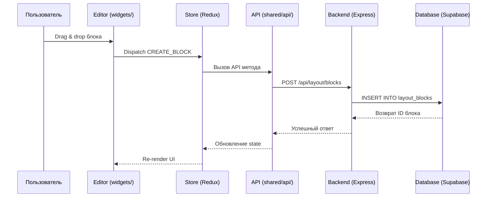
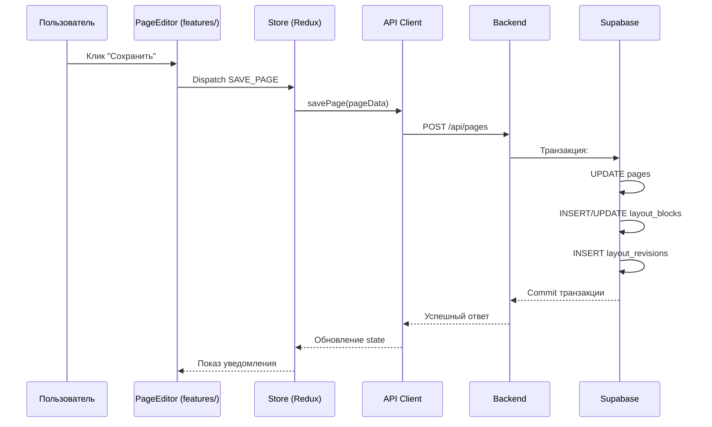
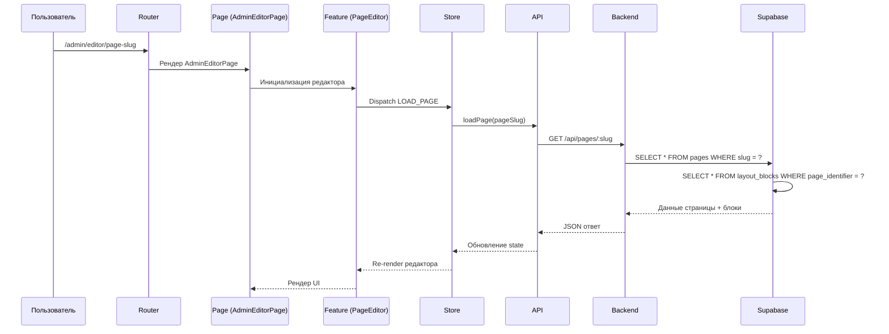

# Архитектурная карта CMS-системы (аналог Elementor)

## Общая архитектура

```mermaid
graph TB
    subgraph "Frontend (React + FSD)"
        A[App.tsx - главный роутер]
        B[pages/ - страницы]
        C[widgets/ - крупные UI блоки]
        D[features/ - бизнес-логика]
        E[entities/ - бизнес-сущности]
        F[shared/ - переиспользуемый код]
        G[blocks/ - система блоков]

        A --> B
        B --> C
        B --> D
        D --> E
        D --> F
        C --> F
        G --> F
    end

    subgraph "Backend (Express + TypeScript)"
        H[index.ts - точка входа]
        I[routes/ - API роуты]
        J[services/ - бизнес-логика]
        K[middleware/ - миддлвары]
        L[core/ - основные сервисы]

        H --> I
        H --> K
        I --> J
        J --> L
    end

    subgraph "Packages (pnpm workspaces)"
        M[@my-forum/ui - дизайн-система]
        N[@my-forum/db-types - типы БД]
    end

    subgraph "Database (Supabase/PostgreSQL)"
        O[layout_blocks - блоки макета]
        P[categories - категории блоков]
        Q[sections - секции]
        R[pages - страницы]
        S[reusable_blocks - переисп. блоки]
        T[layout_revisions - ревизии]
    end

    A --> H
    H --> O
    M --> A
    N --> A
    N --> H
```

## Структура FSD слоев

### Frontend (FSD архитектура)

```
frontend/src/
├── app/                    # Конфигурация приложения и провайдеры
│   ├── App.tsx            # Главный роутер
│   ├── providers/         # React контексты и провайдеры
│   └── styles/            # Глобальные стили
├── pages/                 # Страницы приложения
│   ├── HomePage/          # Публичная домашняя страница
│   ├── AdminLayout/       # Layout админ-панели
│   ├── Admin*Page/        # Страницы админки
│   └── LoginPage/         # Страница авторизации
├── widgets/               # Крупные UI блоки
│   ├── EditorToolbar/     # Панель инструментов редактора
│   ├── BlockRenderer/     # Рендерер блоков
│   ├── ContextualInspector/ # Панель свойств
│   └── UnifiedSidebar/    # Боковая панель
├── features/              # Бизнес-логика и фичи
│   ├── PageEditor/        # Логика редактора страниц
│   ├── ReusableBlocksLibrary/ # Библиотека блоков
│   ├── BlockEditors/      # Редакторы свойств блоков
│   └── EditCategoryModal/ # Модальные окна
├── entities/              # Бизнес-сущности
│   ├── category/          # Сущность категории
│   ├── property/          # Сущность свойства
│   └── server/            # Сущность сервера
├── shared/                # Переиспользуемый код
│   ├── api/               # API клиенты
│   ├── components/        # Общие компоненты
│   ├── contexts/          # React контексты
│   ├── hooks/             # Кастомные хуки
│   ├── lib/               # Утилиты
│   └── types/             # Типы TypeScript
└── blocks/                # Система блоков
    ├── atomic/            # Атомарные блоки (Button, Heading, etc.)
    └── layout/            # Layout блоки (Container, Columns)
```

### Backend (слойная архитектура)

```
backend/src/
├── index.ts               # Точка входа Express приложения
├── core/                  # Основные сервисы
│   ├── APIManager.ts      # Управление API
│   ├── ContentManager.ts  # Управление контентом
│   ├── UserManager.ts     # Управление пользователями
│   ├── TemplateEngine.ts  # Шаблонизатор
│   └── PluginManager.ts   # Менеджер плагинов
├── routes/                # API роуты
│   ├── layoutRoutes.ts    # Роуты для блоков макета
│   ├── pageRoutes.ts      # Роуты для страниц
│   ├── categoryRoutes.ts  # Роуты для категорий
│   └── reusableBlocksRoutes.ts # Роуты для переисп. блоков
├── services/              # Бизнес-логика
│   ├── layoutService.ts   # Сервис блоков макета
│   ├── cacheService.ts    # Кэширование
│   └── reusableBlocksService.ts # Сервис переисп. блоков
├── middleware/            # Миддлвары
│   ├── authMiddleware.ts  # Аутентификация
│   ├── cacheMiddleware.ts # Кэширование
│   ├── rateLimitMiddleware.ts # Ограничение запросов
│   └── loggingMiddleware.ts # Логирование
└── examples/              # Примеры использования
```

## Поток данных: от UI-блоков → state → calls → Supabase

### 1. Создание/редактирование блока



### 2. Сохранение страницы



### 3. Загрузка страницы для редактирования



## Границы публичных API

### Frontend API слой (shared/api/)

```
shared/api/
├── baseApi.ts            # Базовый API клиент (axios)
├── categories.ts         # API категории блоков
├── layout.ts             # API блоков макета
├── pages.ts              # API страниц
├── reusableBlocks.ts     # API переиспользуемых блоков
├── sections.ts           # API секций
└── templates.ts          # API шаблонов
```

### Backend API роуты

```
API Endpoints:
├── /api/layout           # Управление блоками макета
│   ├── GET /blocks       # Получить блоки страницы
│   ├── POST /blocks      # Создать блок
│   ├── PUT /blocks/:id   # Обновить блок
│   └── DELETE /blocks/:id # Удалить блок
├── /api/categories       # Управление категориями
├── /api/pages            # Управление страницами
├── /api/reusable-blocks  # Переиспользуемые блоки
├── /api/sections         # Секции
└── /api/templates        # Шаблоны страниц
```

## Точки входа

### Публичные роуты
- `/` - Домашняя страница
- `/login` - Авторизация
- `/forbidden` - Страница запрета доступа

### Админ-панель (`/admin`)
- `/admin/analytics` - Аналитика
- `/admin/content` - Управление контентом
- `/admin/media` - Медиа-файлы
- `/admin/users` - Пользователи
- `/admin/editor/:pageSlug` - **Визуальный редактор страниц**
- `/admin/categories` - Категории блоков
- `/admin/sections` - Секции
- `/admin/pages` - Страницы

### Служебные роуты
- `/health` - Health check
- `/cache/stats` - Статистика кэша
- `/cache/clear` - Очистка кэша

## Анти-паттерны архитектуры

### Обнаруженные проблемы:

1. **Дублирование App.tsx**: 
   - `frontend/src/App.tsx` - демо-страница
   - `frontend/src/app/App.tsx` - основной роутер
   - **Проблема**: путаница в точках входа

2. **Смешение слоев FSD**:
   - Некоторые компоненты из `widgets/` импортируют напрямую из `features/`
   - **Нарушение**: widgets должны зависеть только от shared/entities

3. **Отсутствие строгой типизации**:
   - Много `any` типов в API ответах
   - Недостаточная типизация JSONB полей в БД

4. **Циклические зависимости**:
   - Возможны циклы между features и widgets
   - Требуется аудит импортов

### Рекомендации по исправлению:

1. **Объединить точки входа**: Удалить демо `App.tsx`, использовать только `app/App.tsx`
2. **Установить правила импортов**: widgets ← features ← entities ← shared
3. **Усилить типизацию**: Заменить `any` на строгую типизацию
4. **Добавить линтеры**: Запретить циклические импорты

## Заключение

Архитектура следует принципам FSD и имеет четкое разделение ответственности:
- **Frontend**: React + Redux Toolkit + FSD
- **Backend**: Express + TypeScript + сервисы
- **Database**: Supabase/PostgreSQL с RLS
- **Packages**: pnpm workspaces для переиспользования

Основные сильные стороны:
- Четкая FSD структура
- Разделение frontend/backend
- Типизированные API
- RLS безопасность

Требует доработки:
- Устранение дублирования App.tsx
- Усиление типизации
- Аудит зависимостей между слоями
